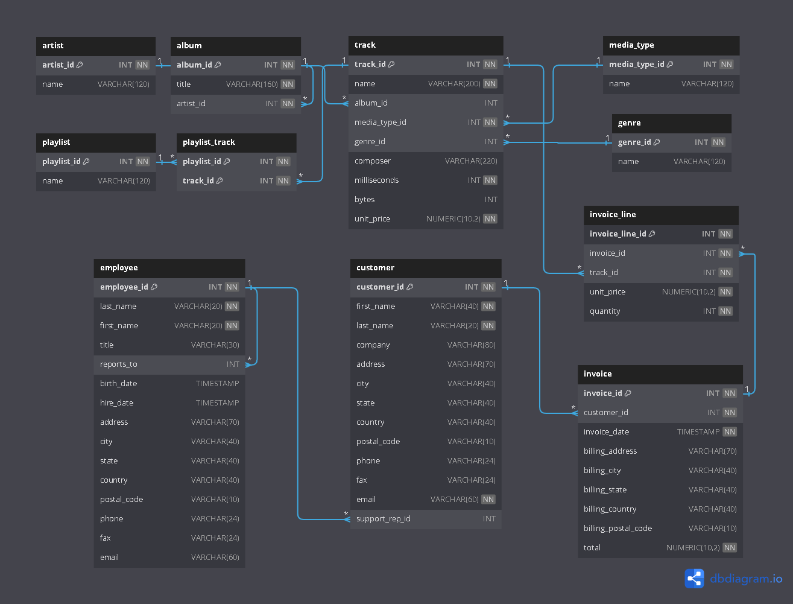

# Chinook Data Analysis

Dataset available at [link](https://github.com/lerocha/chinook-database/releases)

### ER Diagram

## Project Description
This project involves analyzing the Chinook database, which is a sample database representing a digital media store. The database contains information about artists, albums, media tracks, invoices, and customers. The goal of this project is to extract meaningful insights and answer various business questions using SQL queries.

### Conclusion:
This project demonstrates the use of SQL for data analysis and provides insights into the sales and customer behavior of a digital media store. The analysis can help in making informed business decisions and improving sales strategies.